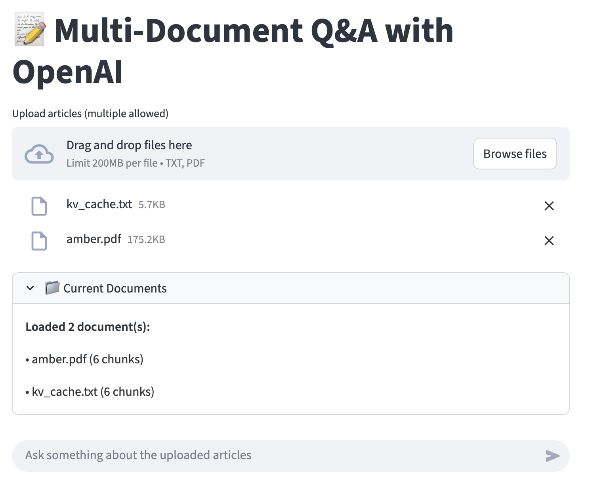
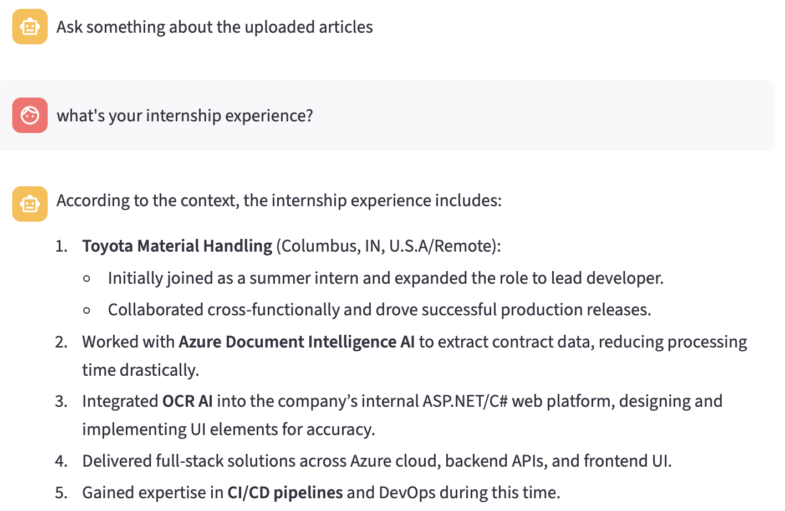
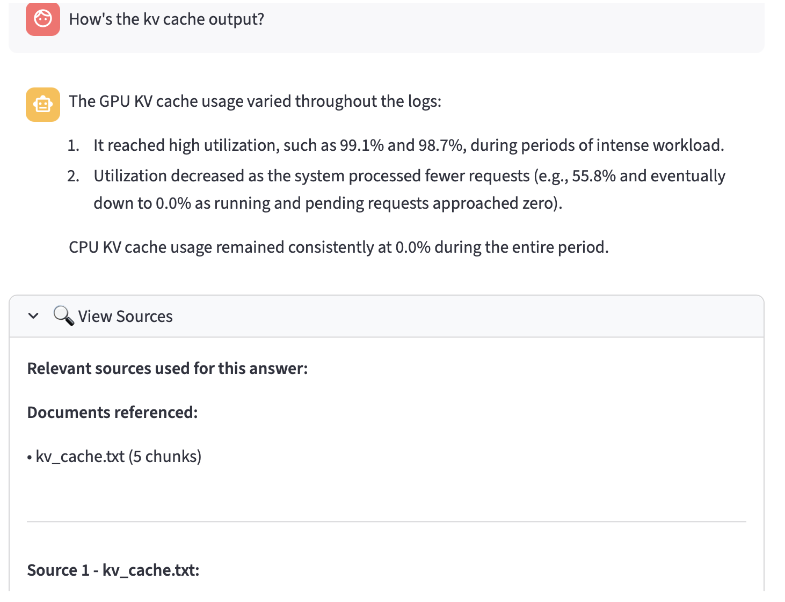
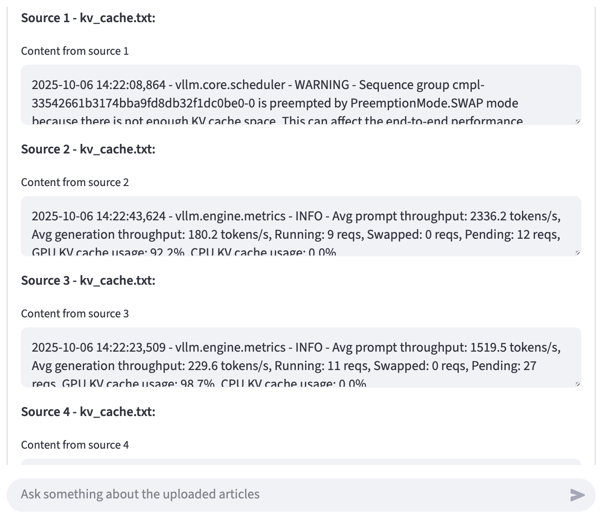

## INFO 5490 Assignment1

### Instruction to run the app

Type in the following line in terminal to run the app:

``````
API_KEY=sk-xxxxxx_xxxxxx streamlit run chat_with_pdf.py 
``````

&nbsp;

### Feature overview

Upload multiple documents:



Ask question regarding the article uploaded:



Seeing which source is the answer based on:





&nbsp;

### Configuration changes

N/A